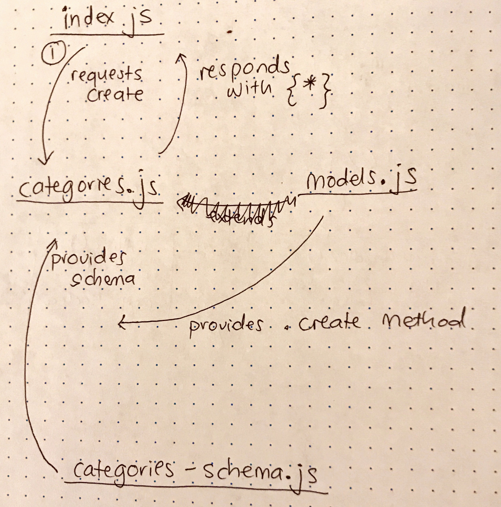

# LAB - 05

## Singular and Modular Models

### Author: Joanna Arroyo

### Links and Resources
* [submission PR](https://github.com/joanna-401-advanced-javascript/lab-05/pull/3)
* [travis](https://travis-ci.com/joanna-401-advanced-javascript/lab-05)
* [front-end](https://joanna-lab-05.herokuapp.com/)

#### Documentation
* [jsdoc](https://joanna-lab-05.herokuapp.com/docs/)

### Modules
#### `mongo.js`
##### Exported Values and Methods

###### `get(id) -> {*}`
Retrieves one or more records

###### `create(record) -> {*}`
Creates a new record

###### `update(id, record) -> {*}`
Replaces a record in the database

###### `delete(id) -> {*}`
Deletes a record in the model

### Setup
#### `.env` requirements
* `MONGODB_URI` - URL to the running mongo instance/db

#### Running the app
* `npm start`
* Endpoint: `/`
  * Returns a JSON object with abc in it.
* Endpoint: `/docs/`
  * Returns JSDocs documentation pages
  
#### Tests
* Unit Test: `npm test`
* Lint Test: `npm run lint`

#### UML

